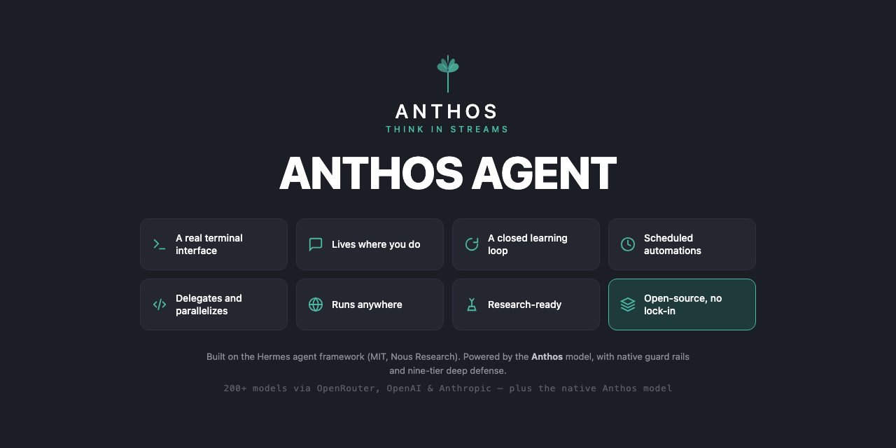

<p align="center">
  
</p>

# Anthos Agent

**The self-improving AI agent built by [Brian Tushae Thomas](https://github.com/TushaeBXN).** Built on top of the open-source Hermes Agent framework (MIT licensed, by Nous Research), Anthos Agent features a built-in learning loop — it creates skills from experience, improves them during use, nudges itself to persist knowledge, searches its own past conversations, and builds a deepening model of who you are across sessions.

Use any model you want — OpenRouter (200+ models), OpenAI, Anthropic, or your own endpoint. Switch with `anthos model` — no code changes, no lock-in.

## Features

| Feature | Description |
|---|---|
| **A real terminal interface** | Full TUI with multiline editing, slash-command autocomplete, conversation history, interrupt-and-redirect, and streaming tool output. |
| **Lives where you do** | Telegram, Discord, Slack, WhatsApp, Signal, and CLI — all from a single gateway process. |
| **A closed learning loop** | Agent-curated memory with periodic nudges. Autonomous skill creation after complex tasks. Skills self-improve during use. FTS5 session search with LLM summarization. |
| **Scheduled automations** | Built-in cron scheduler with delivery to any platform. Daily reports, nightly backups, weekly audits — all in natural language. |
| **Delegates and parallelizes** | Spawn isolated subagents for parallel workstreams. Write Python scripts that call tools via RPC. |
| **Runs anywhere** | Six terminal backends — local, Docker, SSH, Singularity, Modal, and Daytona. |
| **Research-ready** | Batch trajectory generation, trajectory compression for training tool-calling models. |

---

## Quick Install

```bash
git clone https://github.com/TushaeBXN/anthos-agent.git
cd anthos-agent
pip install -e ".[all]"
anthos
```

## Usage

```bash
# Start the CLI
anthos

# Start the agent directly
anthos-agent

# Switch models
anthos model
```

## Configuration

Anthos Agent stores its configuration in `~/.anthos/` (or `%LOCALAPPDATA%\anthos` on Windows).

- `config.yaml` — main configuration
- `.env` — API keys and secrets
- `skills/` — learned skills
- `sessions/` — conversation history

## Credits

Anthos Agent is a fork of [Hermes Agent](https://github.com/NousResearch/hermes-agent) by Nous Research, released under the MIT License. Full credit to the Nous Research team for the incredible foundation.

## License

MIT — see [LICENSE](LICENSE) for details.
